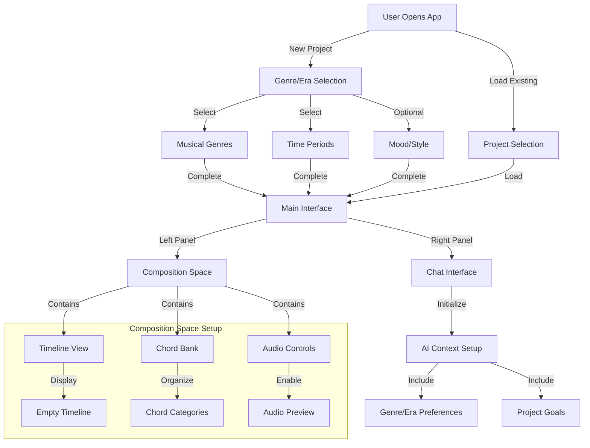
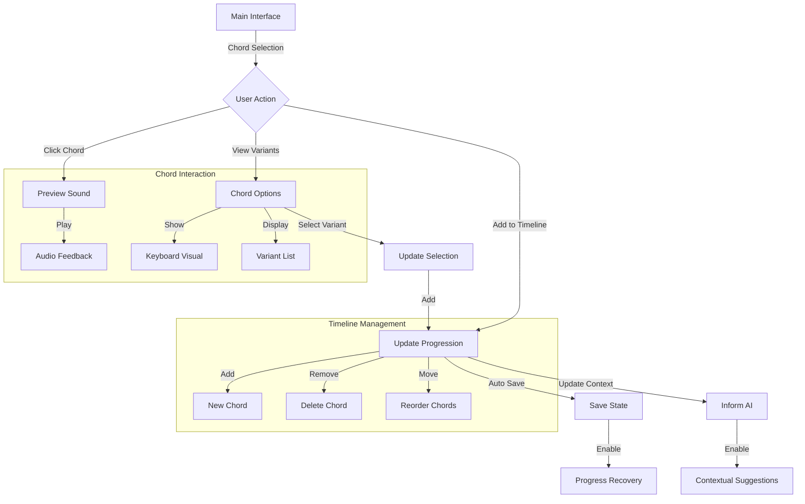
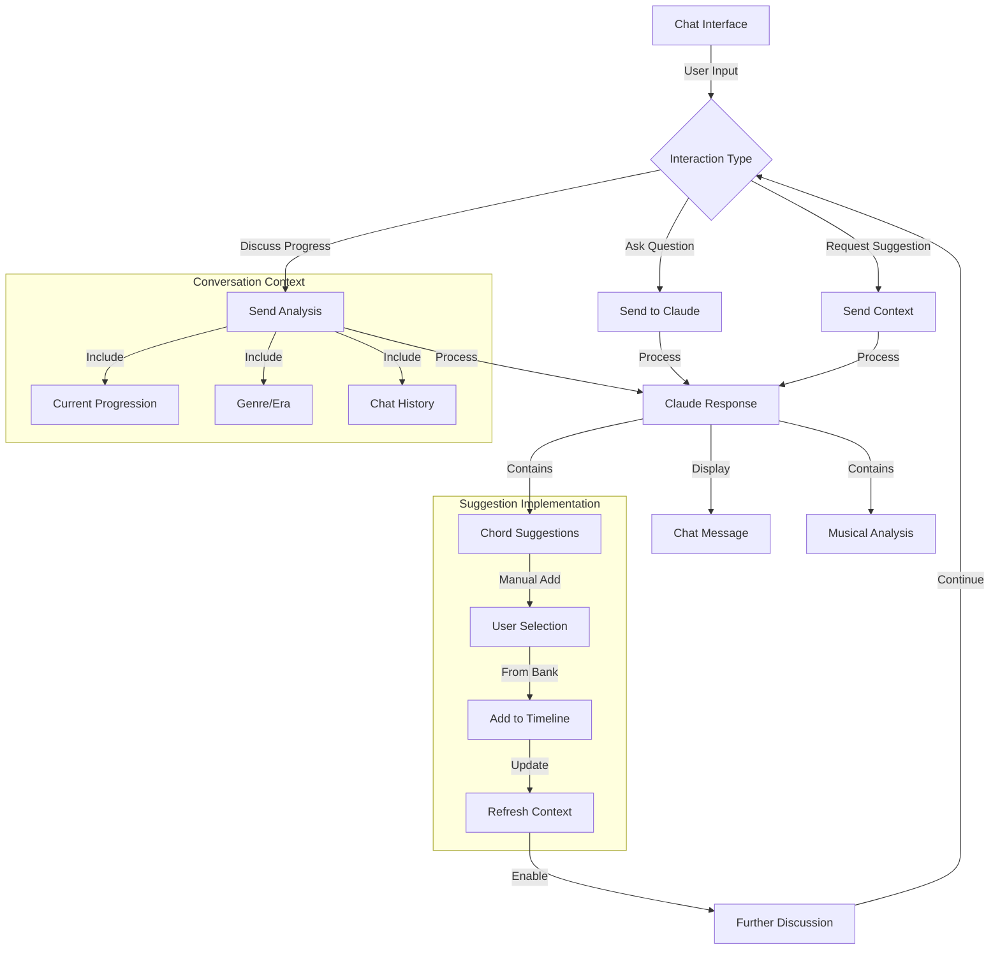
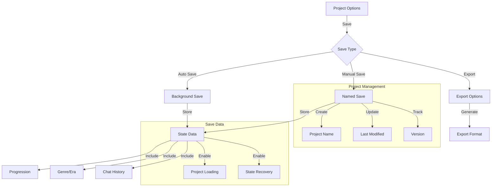

# Progressio: User Flows
**Version:** 1.0
**Date:** December 20, 2024

## 1. Project Setup & Initial Flow

```mermaid
flowchart TD
    Start[User Opens App] -->|New Project| A[Genre/Era Selection]
    Start -->|Load Existing| B[Project Selection]
    
    A -->|Select| C[Musical Genres]
    A -->|Select| D[Time Periods]
    A -->|Optional| E[Mood/Style]
    
    C & D & E -->|Complete| F[Main Interface]
    B -->|Load| F
    
    F -->|Left Panel| G[Composition Space]
    F -->|Right Panel| H[Chat Interface]
    
    G -->|Contains| I[Timeline View]
    G -->|Contains| J[Chord Bank]
    G -->|Contains| K[Audio Controls]
    
    H -->|Initialize| L[AI Context Setup]
    L -->|Include| M[Genre/Era Preferences]
    L -->|Include| N[Project Goals]
    
    subgraph "Composition Space Setup"
        I -->|Display| O[Empty Timeline]
        J -->|Organize| P[Chord Categories]
        K -->|Enable| Q[Audio Preview]
    end
```

## 2. Core Composition Flow

```mermaid
flowchart TD
    A[Main Interface] -->|Chord Selection| B{User Action}
    
    B -->|Click Chord| C[Preview Sound]
    B -->|View Variants| D[Chord Options]
    B -->|Add to Timeline| E[Update Progression]
    
    D -->|Select Variant| F[Update Selection]
    F -->|Add| E
    
    E -->|Auto Save| G[Save State]
    E -->|Update Context| H[Inform AI]
    
    subgraph "Chord Interaction"
        C -->|Play| I[Audio Feedback]
        D -->|Show| J[Keyboard Visual]
        D -->|Display| K[Variant List]
    end
    
    subgraph "Timeline Management"
        E -->|Add| L[New Chord]
        E -->|Remove| M[Delete Chord]
        E -->|Move| N[Reorder Chords]
    end
    
    H -->|Enable| O[Contextual Suggestions]
    G -->|Enable| P[Progress Recovery]
```

## 3. AI Interaction Flow

```mermaid
flowchart TD
    A[Chat Interface] -->|User Input| B{Interaction Type}
    
    B -->|Ask Question| C[Send to Claude]
    B -->|Request Suggestion| D[Send Context]
    B -->|Discuss Progress| E[Send Analysis]
    
    C & D & E -->|Process| F[Claude Response]
    
    F -->|Display| G[Chat Message]
    F -->|Contains| H[Chord Suggestions]
    F -->|Contains| I[Musical Analysis]
    
    subgraph "Suggestion Implementation"
        H -->|Manual Add| J[User Selection]
        J -->|From Bank| K[Add to Timeline]
        K -->|Update| L[Refresh Context]
    end
    
    subgraph "Conversation Context"
        E -->|Include| M[Current Progression]
        E -->|Include| N[Genre/Era]
        E -->|Include| O[Chat History]
    end
    
    L -->|Enable| P[Further Discussion]
    P -->|Continue| B
```

## 4. Save & Export Flow

```mermaid
flowchart TD
    A[Project Options] -->|Save| B{Save Type}
    
    B -->|Auto Save| C[Background Save]
    B -->|Manual Save| D[Named Save]
    B -->|Export| E[Export Options]
    
    C -->|Store| F[State Data]
    D -->|Store| F
    
    F -->|Include| G[Progression]
    F -->|Include| H[Genre/Era]
    F -->|Include| I[Chat History]
    
    E -->|Generate| J[Export Format]
    
    subgraph "Save Data"
        F -->|Enable| K[Project Loading]
        F -->|Enable| L[State Recovery]
    end
    
    subgraph "Project Management"
        D -->|Create| M[Project Name]
        D -->|Update| N[Last Modified]
        D -->|Track| O[Version]
    end
```
